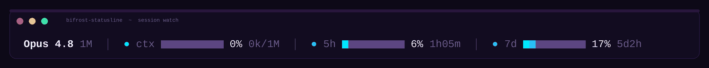
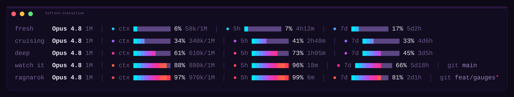

# bifrost-statusline

A synthwave HUD for a Claude Code session: model, context, and usage windows in one line. Also runs with Codex CLI via a tmux workaround.



[](LICENSE)

## What it shows

- `ctx`, context window used
- `5h`, rolling five-hour usage window
- `7d`, rolling weekly usage window
- `git`, current branch, `*` if dirty



## Install

### Claude Code

**Auto:**

```bash
curl -fsSL https://raw.githubusercontent.com/ironmoose/bifrost-statusline/main/install.sh | bash
```

**Manual:** copy `statusline.py` to `~/.claude/bifrost-statusline.py` and add:

```json
"statusLine": {
  "type": "command",
  "command": "python3 ~/.claude/bifrost-statusline.py",
  "refreshInterval": 30
}
```

Needs Python 3.8+.

### Codex CLI

> [!IMPORTANT]
> Not a native Codex integration. Codex's footer can't run an external renderer, so Bifrost launches Codex inside a private tmux server and draws the line in tmux's status bar instead. Plain `codex` won't show it.

Needs Python 3.11+ and `tmux`.

```bash
python3 install-codex.py
```

```bash
~/.local/bin/bifrost codex
~/.local/bin/bifrost codex resume
~/.local/bin/bifrost codex --model gpt-5-codex
```

More in [docs/codex.md](docs/codex.md).

## Configuration

Layout is controlled by constants at the top of `statusline.py`: segment order, gradient style vs. flat fill, an optional frame, and the color ramp. Refresh cadence and how `ctx` differs from Codex's own percentage: [docs/telemetry.md](docs/telemetry.md).

## Example output

```
Opus 4.8 1M │ ● ctx ██████░░░░ 61% 610k/1M │ ● 5h ███████░░░ 73% 1h5m │ ● 7d █████░░░░░ 45% 3d5h
```

```
Opus 4.8 1M │ ● ctx █░░░░░░░░░ 6% 58k/1M │ ● 5h █░░░░░░░░░ 7% 4h12m │ ● 7d ██░░░░░░░░ 17% 5d2h │ git main
```

## Docs

- [docs/codex.md](docs/codex.md): Codex CLI setup and internals
- [docs/telemetry.md](docs/telemetry.md): how the numbers work
- [docs/development.md](docs/development.md): tests and regenerating assets

## License

MIT, see [LICENSE](LICENSE).
